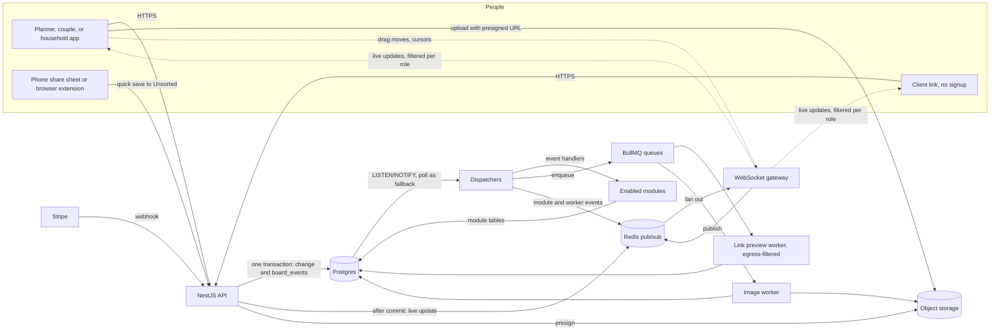

# Architecture

## Stack

| Layer | Choice |
|-------|--------|
| Web app | React with TanStack Start |
| API and WebSocket gateway | NestJS |
| Background work | BullMQ workers on Redis |
| Database | Postgres |
| Pub/sub and queues | Redis |
| File storage | S3-compatible (Cloudflare R2 or S3) |
| Payments | Stripe Checkout, Billing, webhooks |
| Hosting | Fly.io or Railway, at least 2 API instances |

## Runtime components

## The write path

This section describes the complete target architecture. [Backend work unit
3](14-backend-board-core.md) implements transactional board/section/note writes,
event sequence allocation, and the existing notification trigger. Redis event
publishing, dispatchers, workers, and WebSockets remain later work units.

1. The API checks the caller's board role, changes the core tables, increments `boards.event_seq`, and inserts one `board_events` row with that `board_seq`, all in one transaction. The increment locks the board row, so a board's events commit in `board_seq` order.
2. After commit, the API publishes the event to the board's Redis channel. Open browsers update at once, without waiting for the dispatcher.
3. A trigger calls `pg_notify('board_events', id)`. A dispatcher claims the event, creates one `board_event_deliveries` row per target, and sets `fanned_out_at`. Targets are each enabled module that listens to the event type, and each job queue it feeds.
4. Each delivery runs and retries on its own, with backoff. After 10 attempts it gets `failed_at` and stops. A failing module never blocks another module and never rolls back the user's change.
5. When every delivery is done or failed, the dispatcher sets `dispatched_at`. An event with no targets gets `fanned_out_at` and `dispatched_at` together.

Workers and module handlers follow the same rule as the API: write the change and its event in one transaction, then publish the event to Redis after commit.

A transaction that writes events on several boards (`preview.ready`, a workspace member change) first locks all their board rows with one `select ... for update order by id`. Every writer takes board locks in the same order, so two such transactions never deadlock.

### Handler rules

- **Idempotent.** A delivery can run more than once. Handlers upsert, or key their inserts on a natural key (`checklist_tasks.source_key`).
- **Read current state.** Deliveries retry and run concurrently, so a handler can see events late or out of order. Handlers load the current rows rather than trusting the event payload.
- **Chain through events, not in parallel.** When one module's result feeds another, the first module writes its own event. Checklist listens to `approval.state_changed`, not `item.decided`.
- **Compute on read when nothing needs storing.** Budget totals come from current items on each request, so budget has no handler.

### Scaling the dispatcher

- Each dispatcher instance claims batches of up to 100 events where `fanned_out_at` is null, with `FOR UPDATE SKIP LOCKED`, so instances never fan out the same event. Fan-out only inserts rows, so it never waits on a module.
- Any instance runs due deliveries, claimed from `board_event_deliveries` the same way. A delivery in backoff holds no claim, so it never delays other deliveries.
- The dispatcher also polls every 5 seconds, so a missed notification only delays an event.
- A nightly job deletes events whose `dispatched_at` is older than 30 days, in batches of 10,000. Failed deliveries count as finished, so every event is eventually deleted.

## Realtime

- Clients open one WebSocket per open board. The gateway resolves the board role once on connect and caches it on the connection.
- The gateway resolves roles again for every connection to a board when it receives `access.changed` for that board, and at each participant's `expires_at`. Anyone left without a role gets `session.ended` and is disconnected.
- Before sending, the gateway redacts each message for the connection's role. A connection below `show_prices_to` gets items without `price_cents`, and each budget event becomes a placeholder with only its `board_seq` and type `redacted`. The placeholder keeps the sequence unbroken, so the client never mistakes a hidden event for a lost one.
- Drag moves and cursors go over WebSockets only, throttled to 20 per second. Nothing is written while a card moves.
- On drop, the client sends `PATCH /items/:id/position`. Position fields (`x`, `y`, `z_order`, `section_id`) are last write wins, with no version check.
- Content edits (title, note, price, attributes) send `PATCH /items/:id` with `version`. A stale version returns 409 with the current item.
- Each client tracks the last `board_seq` it applied. A live event that skips a number means a message was lost, so the client fetches the missing range. On reconnect it calls `GET /boards/:id/events?after=<seq>` to catch up. If part of the range has been deleted, the server returns 410 and the client reloads the board.

## Background jobs

| Queue | Trigger | Work |
|-------|---------|------|
| `fetch-preview` | `item.created` with a link, preview missing or expired | Fetch the page through the egress filter, read Open Graph and JSON-LD, update `link_previews`, write `preview.ready` on every board using it |
| `process-image` | `item.created` with a pending asset | Check the stored object, write a thumbnail, extract a colour palette, mark the asset ready |
| `refresh-previews` | Nightly | Refetch previews past `expires_at` that boards still use |
| `prune-events` | Nightly | Delete dispatched events older than 30 days |
| `gc-storage` | Nightly | Delete `assets` rows whose `created_at` is over 24 hours old and that no item uses. Then delete stored objects that no row references as `storage_key` or `thumbnail_key` |
| `send-email` | Invites, approvals, reminders | Send transactional email, rendered for each recipient's role on the board |
| `export-pdf` | Export request | Render the board with the kit's export template, for the requester's role |

## Security basics

- **Link previews:** the worker fetches only `http` and `https` on ports 80 and 443. It resolves the host first and refuses private, loopback, link-local, and cloud metadata addresses, and checks again after every redirect, with at most 3 redirects. Timeout 5 seconds, response cap 2 MB.
- **Share and client links:** the token is `<id>.HMAC(secret, id:link_version)`. The server can rebuild the current link at any time. Getting a new link increments `link_version`, which ends the old one. Rotating the secret ends every link at once.
- **Invites:** only a hash of the token is stored. Resending issues a new token.
- **Uploads:** the presigned PUT signs `Content-Type` and `Content-Length` from the presign request, after the plan's upload cap is checked. Storage refuses any other size or type. The image worker checks the stored object again and marks the asset failed on a mismatch.
- **Images:** served through signed URLs that expire after 5 minutes, issued after a role check on the asset's board.
- **No role, no board:** return 404, not 403.
- **Payments:** grant Stripe entitlements only from webhooks, never from the redirect back to the app. Record the event and apply the grant in one transaction.
- **Item data:** validate `items.attributes` against the item kind's schema on every write.
