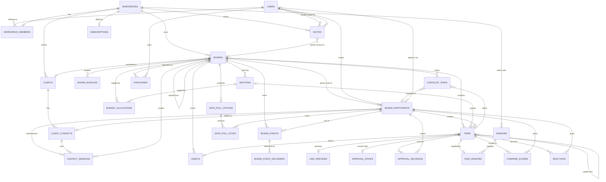

# Data model

32 tables in five groups. The full DDL is in [../db/schema.sql](../db/schema.sql).

| Group | Tables |
|-------|--------|
| Authentication | `auth_sessions`, `contact_sessions`, `google_auth_attempts`, `auth_rate_limits` |
| People and access | `users`, `workspaces`, `workspace_members`, `invites`, `clients`, `client_contacts`, `board_participants` |
| Boards and content | `boards`, `board_modules`, `sections`, `items`, `assets`, `link_previews`, `board_events`, `board_event_deliveries` |
| Billing | `subscriptions`, `purchases`, `stripe_events` |
| Modules | `approval_states`, `approval_decisions`, `budget_allocations`, `vendors`, `item_vendors`, `checklist_tasks`, `compare_scores`, `date_poll_options`, `date_poll_votes`, `reactions` |

## Entity relationships

Column lists live in `db/schema.sql`. The animated map shows them per table: https://claude.ai/artifact/UbW4svCBWDe7u3qKMkw13E

## Design rules

### Identity

- Account credentials use nullable `users.password_hash` and unique nullable
  `users.google_subject`. Google subject identifies the external account; email
  matching never links accounts automatically. Session tokens and OAuth state
  are stored only as hashes. Authentication runtime rows expire; the session
  guard rejects expired sessions and deleted users.

- `board_participants` is the one identity on a board. A row holds `user_id` (signed in), `contact_id` (client link), or both. Items, decisions, scores, votes, and reactions all point at a participant, so no module handles "user or contact" itself.
- A row with `role` null records a person who got in through general access or the business owner rule. The API creates it the first time a signed-in person opens the board. It grants nothing, so restricting the board still removes them. Creating it writes no `participant.joined` and counts toward no participant-based rule, so opening a board has no side effects.
- Plan limits on people per board count rows with a set `role` that are not revoked or expired. Role-null rows, anonymous link visitors, and the business owner rule never count.
- Planned account linking: a client contact who signs up gets `user_id` set on their contact row, so the link and the account share one identity. If that user already has a row on the board, the two rows stay separate.
- Workspaces are either `business` or `personal`. Sign-up creates a personal workspace. The word "workspace" never appears in a personal account's UI.

### Deletion

Items, decisions, and events point at participant rows, so people are anonymized, not deleted. Only deleting a whole workspace removes rows. Purchases survive it as payment records, with `board_id` cleared.

| Action | Effect |
|--------|--------|
| Delete an account | Applies the leaving rules from access control to each board they solely own, but archives the boards that would otherwise move. Then removes workspace memberships, revokes participant rows, sets `users.deleted_at`, clears email, name, and avatar. Refused while the user is the only owner of a workspace with other members. |
| Remove a client contact | Increments `link_version`, revokes their participant rows, sets `removed_at`, clears name and email |
| Delete a client | Sets `clients.archived_at`. Boards keep their client. |

### Content

- A row on a board points only at rows on the same board. Composite foreign keys on `(board_id, id)` enforce this for sections, assets, participants, and items, and `(workspace_id, id)` keeps a board's client and an invite's board in the same workspace. Module tables without `board_id` (decisions, scores, votes, reactions) rely on the API check.
- `items.id` is generated by the client. A retried save with the same id is a no-op, so offline saves never duplicate.
- `items.section_id` null means Unsorted. Quick saves land there.
- `items.x` and `items.y` are null on grid-layout boards.
- `z_order` and `sections.position` are fractional index strings, so reordering touches one row.
- Position fields (`x`, `y`, `z_order`, `section_id`) are last write wins. `version` guards content fields only, so a move never conflicts with someone editing the title.
- `price_cents` and `quantity` are core columns because several modules read them. Everything kit-specific goes in `attributes`, validated against the item kind's schema.
- Money is always integer cents. Splits decide in code who gets the remainder cent.
- `link_previews` is shared across boards and keyed by `url_hash`. Ten boards pinning one restaurant share one row. Saving a link inserts the row only if it is missing and never changes an existing one, so a ready preview stays ready. When a fetch finishes, the worker writes `preview.ready` on every board with a live item that uses the preview. A failed fetch sets `expires_at` one day ahead, so the nightly refresh tries again.
- An `assets` row exists before its item. The flow is presign, upload, then create the item, so a failed upload leaves no broken card. An asset that no item uses after 24 hours is deleted nightly, along with its stored object.
- Every asset belongs to one board, and image access is checked on that board. A copied item gets a new `assets` row on the target board that points at the same `storage_key` and `thumbnail_key`. A stored object is deleted only when no asset row references it under either key.

### Share and client links

- Board-specific contact links use `<participantId>.<signature>`, signing `contact-board:<participantId>:<linkVersion>`. `board_participants.link_version` controls only that assignment. Links are rebuilt on demand and are never stored.
- Contact sessions store opaque token hashes, participant/contact/board IDs, the issued assignment generation, a signing-secret fingerprint, and expiry. Reads recheck current access. Rotation, revocation, and restoration end prior credentials. Removing a contact ends all its assignments.
- Generic board links remain planned and use `boards.link_version`. The legacy `client_contacts.link_version` column is retained but does not authenticate the implemented board-specific links.

### Events

- Every change writes a `board_events` row in the same transaction. A trigger calls `pg_notify`.
- Each event takes the next `board_seq` from `boards.event_seq`. Incrementing it locks the board row until commit, so a board's events commit in `board_seq` order with no gaps. Clients catch up by `board_seq`, never by `id`.
- The dispatcher writes one `board_event_deliveries` row per target (a module or a job queue) and sets `fanned_out_at`. Each target retries alone, up to 10 attempts, then gets `failed_at`. `dispatched_at` is set once every delivery is done or failed.
- Handlers must be idempotent. Module tables that a handler inserts into carry a natural key where needed (`checklist_tasks.source_key`).
- Dispatched events older than 30 days are deleted nightly. Clients that fall further behind reload the board.
- Event types: `board.created`, `board.updated`, `board.upgraded`, `section.created`, `section.updated`, `section.deleted`, `item.created`, `item.moved`, `item.updated`, `item.deleted`, `item.decided`, `approval.state_changed`, `preview.ready`, `asset.ready`, `participant.joined`, `access.changed`, `module.enabled`, `module.disabled`, `budget.changed`.
- Work unit 3 emits board, section, and note mutation events. Work unit 4 adds media events, queue fan-out, leased delivery acknowledgements, and pruning. Redis live publishing and replay remain deferred.

### Modules

- A module owns its tables. Module tables point at `boards`, `items`, `sections`, `board_participants`, or their own module's tables, never at another module.
- Disabling a module hides its data. Nothing is deleted.
- Module tables are shared by every board, so a module changes them with ordinary migrations that keep existing rows valid. A config change migrates stored `board_modules.config`.

### Billing

- `stripe_events.id` is the Stripe event id. The webhook handler inserts it and applies the grant in one transaction. An insert that conflicts on id means the event was already processed, so the handler skips it. A failed grant rolls back the insert too, so Stripe's retry runs it again.
- A paid Board Pass sets `boards.upgraded_at`. A refund clears it.

### Copies and templates

- `boards.source_board_id` records the board a new one started from.
- `items.copied_from_item_id` records where a copied item came from. Items are copied, never shared across boards, so each board keeps its own history.
- Copying a board copies sections, enabled modules, chosen items, and an asset row for each copied image. It never copies participants, decisions, scores, votes, or reactions.
- A copy keeps `price_cents` only when the caller's role on the source board is at or above `show_prices_to`. Otherwise the copied item has no price.
- Each copied item writes `item.created` on the target board, so a copy of an image that is still processing gets its own `process-image` job.

## Media processing additions

`board_event_deliveries.lease_token` and `lease_until` support bounded queue
handoffs outside database transactions. A queue delivery's `done_at` means
confirmed enqueue, rather than processing completion. Worker result events
allow null participant attribution.

Pending assets point at staging keys; ready assets point at verified immutable
original keys. Thumbnails use separate WebP keys. Attempts that lose the atomic
completion race leave unreferenced objects for the 24-hour cleanup grace.
Preview fetch generations use the existing expiry timestamp. Shared completion
updates metadata and appends events under the resource-before-board lock order.
Failure event types are `asset.failed` and `preview.failed`; failed preview
refreshes preserve previously collected fields.
