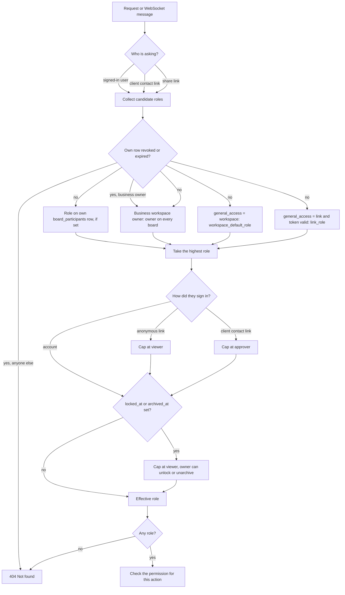

# Access control

Access has two levels. A **workspace role** decides which boards you can find. A **board role** decides what you can do on one board. Each board also has a **general access** setting for people without a personal invite.

## Workspace roles

| Role | Business workspace | Personal workspace |
|------|--------------------|--------------------|
| `owner` | Owner on every board, for recovery | Gets the workspace default role on workspace boards. No access to "Only me" boards. |
| `staff` | Gets the workspace default role on workspace boards | Not used |
| `partner` | Not used | Gets the workspace default role on workspace boards |

## Board roles

| Permission | Owner | Editor | Approver | Viewer |
|------------|:-:|:-:|:-:|:-:|
| `board.view` | yes | yes | yes | yes |
| `item.react`, `poll.vote`, `compare.score` | yes | yes | yes | |
| `item.decide` | yes | yes | yes | |
| `item.create`, `item.edit`, `item.delete`, `item.move` | yes | yes | | |
| `budget.view` | yes | yes | if `show_prices_to` allows | if `show_prices_to` allows |
| `board.share`, `board.modules`, `board.lock`, `board.delete` | yes | | | |

The role-to-permission map lives in code. Modules add their own permissions with a default role.

`show_prices_to` can be `editor`, `approver`, or `viewer`. Editors always see prices, because they edit them.

## General access

| Setting | Who gets in | Use |
|---------|-------------|-----|
| `restricted` | Only `board_participants` rows | "Only me" boards, client boards |
| `workspace` | Every workspace member, at `workspace_default_role` | Default for household boards |
| `link` | Anyone with the share link, at `link_role` | Showing friends or family |

`link_role` can be `viewer` or `approver` only. A forwarded link must never let strangers edit.

A link visitor who is not signed in has no participant row, so they can only view. Signing in creates their row, and `link_role` then applies.

## Resolving a role

One function, `resolveBoardRole(principal, board)`, decides every request and every WebSocket message.

No role returns 404, so a private board's existence never leaks.

Roles rank owner > editor > approver > viewer. The `board_role` enum is declared lowest to highest, so SQL comparisons and `max()` follow rank.

## Where it is enforced

1. **API guard:** every board route resolves the role, then checks the route's permission.
2. **WebSocket gateway:** resolves the role once on connect and caches it on the connection. Each message checks the cached role, so a drag needs `item.move` with no database query. The cache is refreshed on `access.changed` for the board and at the participant's `expires_at`.
3. **Outgoing messages:** the gateway redacts every message for the connection's role before sending. Below `show_prices_to`, items lose `price_cents` and budget events become `redacted` placeholders that keep their `board_seq`. Nothing upstream of the gateway knows about connections, so this is the only place live data is filtered.
4. **Asset URLs:** signed for 5 minutes, issued only after a role check on the asset's board.
5. **Exports, emails, and copies:** each is rendered for one person's role. Below `show_prices_to` they carry no `price_cents` and no budget data, the same as the gateway.

## Closing access

| Action | Column | Effect |
|--------|--------|--------|
| Restrict the board | `general_access = 'restricted'` | Link holders lose access on their next request |
| Get a new link | `boards.link_version` + 1 | The old link returns 404; the board stays shareable |
| Remove a person | `board_participants.revoked_at` | That person loses access, even through general access or a link. A business owner keeps owner. |
| Time-limited access | `board_participants.expires_at` | Access ends on the date, the same way |
| Lock the board | `boards.locked_at` | Everyone becomes a viewer |
| Archive the board | `boards.archived_at` | Everyone becomes a viewer. The board no longer counts toward the plan's active boards. |
| Remove a workspace member | `workspace_members` row deleted, their participant rows on the workspace's boards revoked with `revoked_on_leave` | They lose every board in that workspace, including boards they were invited to. In a personal workspace, boards they own are handled first, as below. |

### Leaving a personal workspace

A personal workspace owner has no automatic access (D17), so each board where the leaving person is the only owner is handled before their rows are revoked. The first rule that fits applies:

1. **Another member can run it:** the earliest-joined workspace member on the board with `editor` or higher becomes owner. People from outside the household never inherit a board.
2. **The household can already open it:** if `general_access` is `workspace`, the workspace owner becomes owner.
3. **Otherwise it is private to them:** open invites on the board are revoked, then the board moves to the leaving person's own personal workspace. They keep their owner row there. Vendors belong to a workspace, so each household vendor the board's items use is copied into the new workspace and `item_vendors` points at the copy.

Their rows on every board still in the workspace are then revoked.

Business workspaces skip this: the business owner already holds owner on every board.

A personal board always keeps at least one owner. A role change, removal, or `expires_at` that would leave it with none returns 409. An expiry date on an owner row is allowed only while another owner row has none.

Any change to a role or to a board's access settings writes `access.changed` on each affected board. That covers the actions above, a participant role or `expires_at` change, a workspace role change, and every `PATCH /boards/:id/access` field, including `show_prices_to`. The gateway resolves roles and reloads board settings for every open connection to the board, and disconnects anyone left without a role.

## Invites

An invite grants a workspace role, a board role, or both.

| Invite | `workspace_role` | `board_role` | Result |
|--------|------------------|--------------|--------|
| Partner | `partner` | `editor` | Joins the household and the board |
| Friend shown one board | null | `viewer` | Joins only that board |
| New staff member | `staff` | null | Joins the business workspace |

Each person has at most one open invite per workspace and one per board. Re-inviting to the same place replaces the open invite. Invites to different boards stay separate.

Accepting an invite upserts the person's row on the board. If a row already exists (role null from opening the board, or revoked, or expired), it gets the invited role, and `revoked_at`, `expires_at`, and `revoked_on_leave` are cleared.

Rejoining a workspace clears every revocation in it that has `revoked_on_leave` set, so a re-hired staff member gets workspace boards back. Removing someone from a board by hand sets `revoked_on_leave` to false, even on a row already revoked by leaving, so that removal survives a rejoin.

Clients never get a workspace role. A planner adds a contact to a board as `viewer` or `approver`, which creates a participant row with `contact_id` set. The contact must belong to the board's client. The contact link signs the contact in and shows only the boards they were added to.

A contact link is a bearer link that can be forwarded, so a session from it is capped at approver, like a share link. A contact who signs up and uses their account gets the full role on their row.

## Tokens

| Token | Format | Stored | Can be shown again |
|-------|--------|--------|--------------------|
| Board share link | `<board id>.HMAC(secret, id:link_version)` | `link_version` only | Yes, rebuilt on demand |
| Client contact link | `<contact id>.HMAC(secret, id:link_version)` | `link_version` only | Yes, rebuilt on demand |
| Invite | Random | Hash only | No. Resend issues a new token |

Links compare the HMAC in constant time. Rotating the secret ends every share and client link at once.

Invites are never deleted. They end as accepted, revoked, or expired, so the table doubles as a record of who invited whom.
