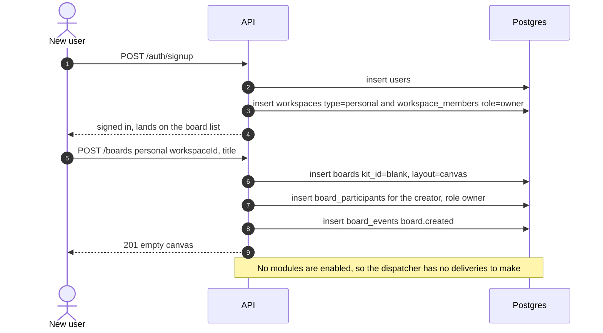
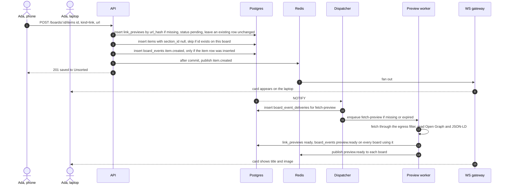
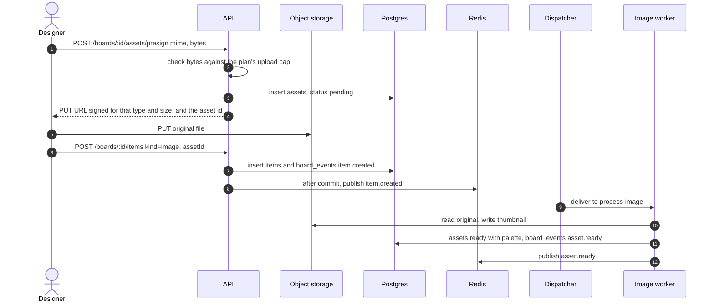
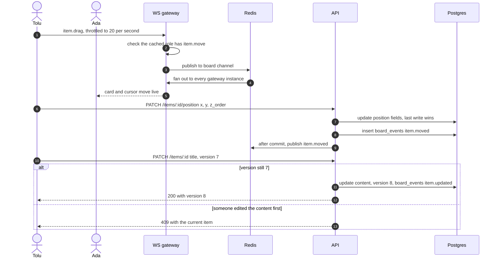
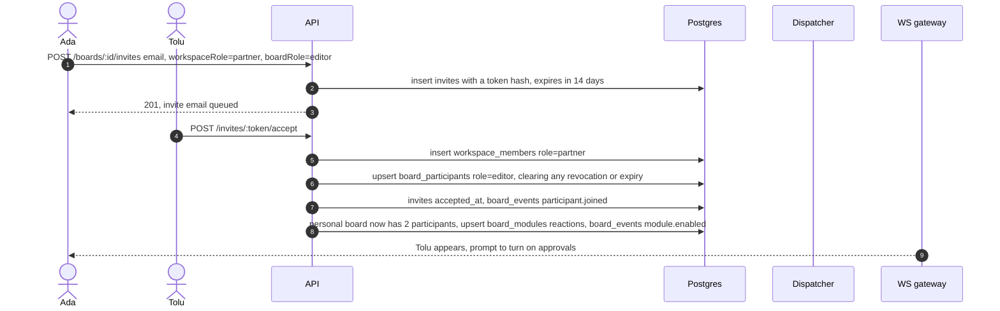
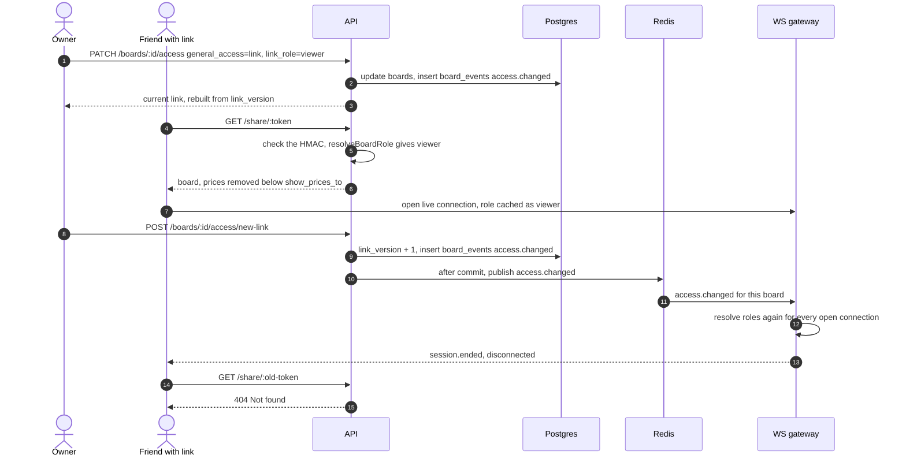
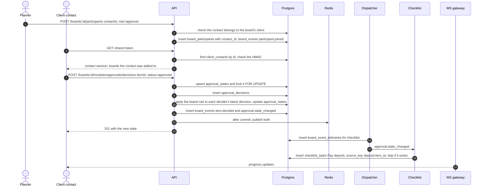
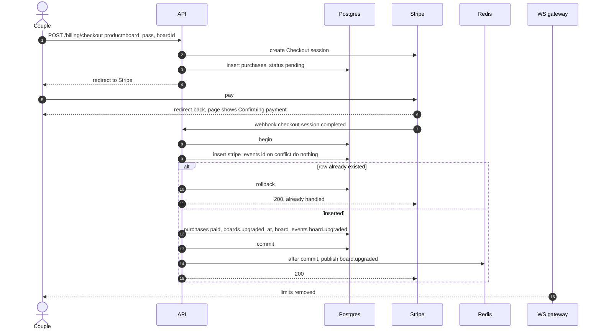
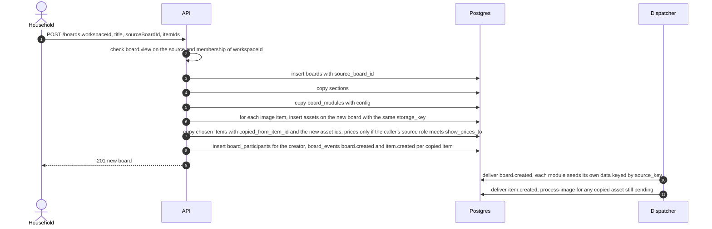

# Flows

Every flow follows the write path in [02-architecture.md](02-architecture.md). The API changes data and writes a `board_events` row in one transaction, publishes the event to Redis after commit, and the dispatcher delivers it to modules and job queues. The gateway redacts every live message for each connection's role.

| # | Flow | Writes |
|---|------|--------|
| 1 | Sign up and first board | `users`, `workspaces`, `workspace_members`, `boards`, `board_participants`, `board_events` |
| 2 | Save a link | `items`, `link_previews`, `board_events` |
| 3 | Upload an image | `assets`, `items`, `board_events` |
| 4 | Live sync | `items`, `board_events` |
| 5 | Invite your partner | `invites`, `workspace_members`, `board_participants`, `board_modules`, `board_events` |
| 6 | Share and revoke access | `boards`, `board_participants`, `board_events` |
| 7 | Approval | `board_participants`, `approval_decisions`, `approval_states`, `checklist_tasks`, `board_events` |
| 8 | Board Pass payment | `stripe_events`, `purchases`, `boards`, `board_events` |
| 9 | New board from a template | `boards`, `sections`, `board_modules`, `assets`, `items`, `board_participants`, `board_events` |

Every flow that reaches the dispatcher also writes `board_event_deliveries`.

## 1. Sign up and first board

## 2. Save a link

Saves from the share sheet or extension land in Unsorted on the last board used.

A board that saves the same URL while a fetch is pending enqueues nothing. It still gets `preview.ready`, because the worker writes one on every board with a live item that uses the preview.

The same item id saved again on the same board is a no-op that returns the existing item. An id that exists on another board returns 409.

## 3. Upload an image

## 4. Live sync

The same path keeps two people, or one person on two devices, in step.

A move never conflicts with a content edit. Only two content edits on the same item can conflict.

## 5. Invite your partner

## 6. Share and revoke access

## 7. Approval

The approvals route updates the state inside the request. Checklist reacts to the state change, not to the raw decision, so it never reads a stale state. Budget computes committed spend on read, so it needs no event.

`approval.state_changed` is written only when the core state changes. With the `all` rule, the first of two approvals writes `item.decided` only. The row lock means two approvals sent at once still end with the item approved.

Opening the link creates no rows. A contact reaches only the boards a planner added them to, so draft boards for the same client stay hidden.

## 8. Board Pass payment

If anything fails before commit, nothing is recorded and Stripe's retry runs the whole grant again. A duplicate delivery that arrives during the first one waits on the id conflict, then skips once the first commits. Business and household plans follow the same path. The webhook writes `subscriptions`, and `customer.subscription.updated` keeps `status` and `current_period_end` current.

## 9. New board from a template

Copying one item with `POST /items/:id/copy` follows the same asset and price rules.
