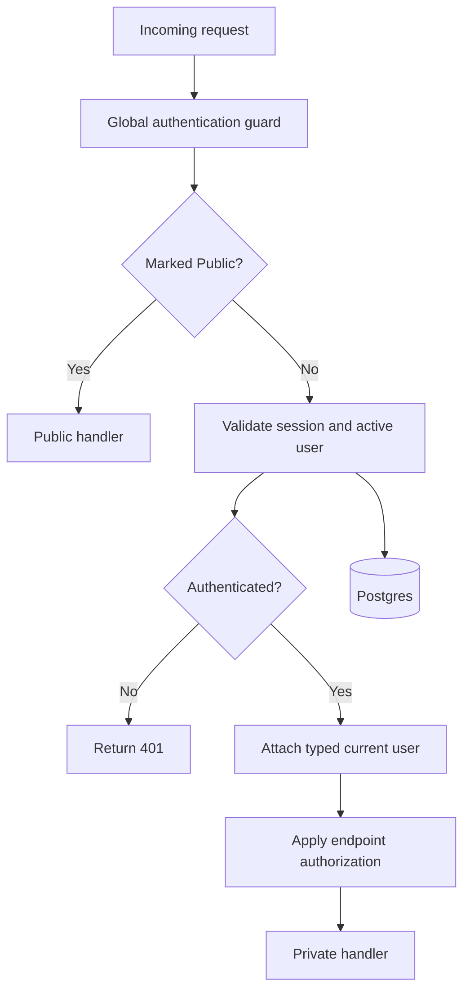
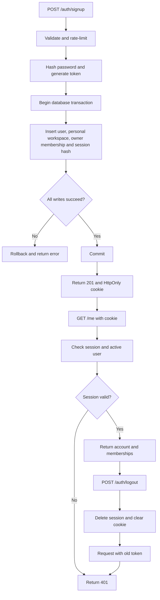
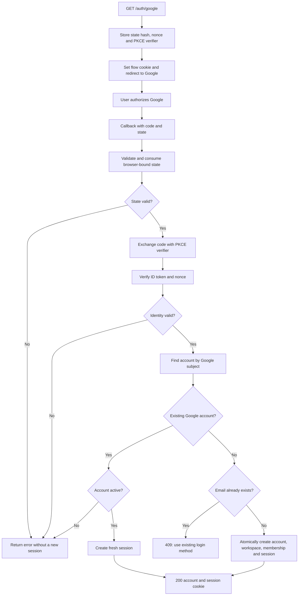

# Backend work unit 2: accounts and workspace onboarding

Branch: `codex/backend-accounts-workspaces`. This PR adds authentication and the
first workspace operations. Boards, invites, clients, workers, billing, account
deletion, linking login methods, password reset, and local email verification
remain later work units.

## Default authentication boundary

`AuthModule` registers `SessionAuthGuard` through `APP_GUARD`. Every controller
route is private unless its handler or controller has `@Public()`. The public
routes are signup, login, the two Google routes, and health. Public auth routes
still receive input validation, origin checks, and rate limits.

`@CurrentUser()` supplies an `AuthPrincipal` with `userId` and `sessionHash`.
Feature code derives the caller from that principal, never from the request
body. The guard establishes identity. It does not grant workspace ownership or
board permissions. Workspace queries filter by membership; future board routes
must apply the documented role resolver and return 404 for inaccessible boards.



## HTTP contracts

| Route | Input | Result |
|-------|-------|--------|
| `POST /auth/signup` | `email`, `password`, `displayName` | 201 account and session cookie |
| `POST /auth/login` | `email`, `password` | 200 account and new session cookie |
| `GET /auth/google` | None | 302 to Google and temporary flow cookie |
| `GET /auth/google/callback` | Google code and state, or consent error | 200 account and session cookie |
| `POST /auth/logout` | `{}` | 204, current session revoked and cookie cleared |
| `GET /me` | None | 200 account |
| `GET /workspaces` | None | 200 membership-filtered workspace array |
| `POST /workspaces` | `name` | 201 business workspace with caller as owner |

An account contains `user` and `workspaces`. The user has `id`, `email`,
`displayName`, nullable `avatarUrl`, and ISO `createdAt`. Each workspace has
`id`, `type`, `name`, nullable `logoKey` and `brandColour`, ISO `createdAt`, and
membership `role`. The list is ordered by database creation time, then id.
Credentials, Google subjects, session hashes, and provider tokens never appear
in account responses. Responses use `Cache-Control: no-store`.

Zod schemas and inferred types live in `packages/contracts`. Request bodies
reject unknown fields. Email is trimmed and lowercased; display and workspace
names are trimmed and must have 1–100 characters. Signup passwords have 15–128
characters and retain all whitespace. Login accepts 1–128 characters so invalid
credentials receive a uniform 401. Invalid input returns 400; duplicate emails
or incompatible login methods return 409. Invalid sessions return 401.

Every POST requires `Content-Type: application/json`. For browser requests,
`Origin` must match `AUTH_ALLOWED_ORIGINS`. Requests without an Origin header,
such as curl, are supported. Credentialed CORS is enabled only for that list.
The JSON requirement blocks cross-origin HTML form submissions without Origin.

## Password onboarding and sessions

Passwords use asynchronous Node scrypt, a random 16-byte salt, and a 64-byte key.
The stored encoding is `scrypt-v1:32768:8:3:<salt hex>:<key hex>`, with 64 MiB
`maxmem`. Missing or malformed credentials perform dummy derivation before a
uniform failure. Signup hashes before entering its database transaction.

Both signup methods create the user, a personal workspace named `Personal`,
owner membership, and initial session in one transaction. A failed write leaves
none of those rows. Business workspace creation likewise creates the workspace
and owner membership together. No board events are written in this work unit.

Session tokens contain 32 random bytes. Only their SHA-256 hashes are stored.
The host-only `moodboard_session` cookie has `HttpOnly`, `SameSite=Lax`, `Path=/`,
and a seven-day lifetime. Production adds `Secure`. Database expiry is absolute,
without sliding renewal. Each private request checks expiry and whether the user
is active. Logout deletes only the current session; other sessions stay valid.



## Google authentication

Configure all three Google fields together. Omit all three to disable Google
routes with 503 while password auth and health remain available. Partial settings
fail configuration validation without logging their values.

```dotenv
GOOGLE_CLIENT_ID=<web OAuth client ID>
GOOGLE_CLIENT_SECRET=<web OAuth client secret>
GOOGLE_CALLBACK_URL=http://127.0.0.1:3001/auth/google/callback
AUTH_ALLOWED_ORIGINS=http://localhost:3000,http://127.0.0.1:3000
```

Production requires explicit HTTPS origins and an HTTPS Google callback.
Register the exact callback URL on a Google Cloud web OAuth client. Configure
consent for `openid email profile` and add test users while the Google app is in
testing mode. Use the same browser hostname when starting the flow and receiving
the callback so its host-only cookie is sent.

The API uses `google-auth-library` for authorization-code exchange and ID-token
verification. It adds S256 PKCE and nonce validation. The temporary
`moodboard_google_flow` cookie is HttpOnly, SameSite=Lax, scoped to `/auth/google`,
and expires after ten minutes. Its random state is stored only as a hash, with
the nonce and PKCE verifier. An atomic DELETE consumes matching, unexpired state
once before contacting Google. State must also match the browser's flow cookie.

Google identities are keyed by `sub`, not email. New identities create an account
only when the email is unused. A collision returns 409 directing the person to
their existing method; this PR never joins identities by email. Returning Google
users keep their stored profile even if provider profile fields change. Deleted
accounts cannot sign in. Provider access/refresh tokens are discarded. Google
requests have a five-second timeout and do not run inside a database transaction.
The callback returns JSON; frontend navigation is a later concern.



### Manual Google smoke test

1. Configure the Google client and matching callback in `.env`; apply migrations
   and run `pnpm dev:api`.
2. Open `http://127.0.0.1:3001/auth/google` in a browser with an allowed test user.
3. Consent and check that the callback shows the account and one personal
   workspace. Open `/me` on that API origin and confirm the same account.
4. Repeat sign-in; check the same user and personal workspace ids.
5. Decline consent in a fresh flow and confirm 401 without a new session.
6. Try Google with a password account's email and confirm 409 without linking.

CI mocks the provider. A live smoke test requires configured credentials and is
not part of automated checks.

## Shared rate limits and migration

Redis stores counters shared across API instances. Signup allows five
requests/minute/IP. Login allows ten/minute/IP and ten/minute/normalized email.
Google start and callback each allow twenty/minute/IP. Exceeded limits return 429
and `Retry-After`. Keys hash IPs and email addresses under the
`moodboard:auth:rate-limit:` prefix. An atomic Lua script increments each counter
and sets a 60-second expiry only on its first attempt. Later requests do not
extend the window. Redis automatically expires counters. Expired OAuth attempts
are cleaned in batches of at most 50 when starting Google sign-in.
Proxy forwarding headers are not trusted by default; deployment must configure
trusted proxies according to the actual network before relying on forwarded IPs.

Configure `REDIS_URL` (`redis://127.0.0.1:6379` locally; `rediss://` is supported
for TLS). One client per API instance reconnects automatically, disables offline
command queuing, and bounds each counter check to one second. A one-second socket
inactivity timeout also covers startup and reconnection handshakes; half-second
heartbeats keep healthy idle connections open. A stalled socket
is discarded; an uncertain increment is never retried within the request.
Redis connection, timeout, or write errors fail closed with a generic 503 on
signup, login, and Google routes. Only exceeded limits return 429.

Sessions and OAuth state remain in Postgres. Redis outages do not prevent API
startup, session validation, logout, or Postgres health checks. Readiness still
reports Postgres and migrations; it does not promise that sign-in is available.
Development Docker binds Redis to loopback, persists its data, and uses
`noeviction` with `REDIS_MAXMEMORY` (default 256mb). Memory exhaustion rejects
writes rather than silently resetting counters. Redis loss or failover can
still reset counters. Production should monitor capacity and isolate queue
traffic when it would threaten authentication availability.

`AccountAuth1791072000000` adds nullable credential columns and three runtime
state tables. Existing users are preserved without credentials. The initial
migration remains immutable; apply both with `pnpm db:migrate`. Run migrations
before API deployment. Never recreate volumes to apply this change. Reverting
this migration removes its credentials and sessions; the CLI continues to permit
reverts only on the disposable test database.

The historical `auth_rate_limits` table remains for migration compatibility;
the API no longer reads or writes it. This change requires no new schema migration.

## Validation

Run `pnpm check` with disposable `TEST_DATABASE_URL` and `TEST_REDIS_URL`
(`redis://127.0.0.1:6380/15`). Tests cover default
private routes and principal attachment, contracts, cookies, hashing, session
revocation/expiry, workspace isolation, rollback and concurrent signup, shared
Redis rate limits across separate connections, counter expiry, fail-closed
outages with existing sessions still working, stalled Redis connection recovery,
Google state replay and identity collisions, invalid provider claims,
and cumulative migration upgrade/revert with legacy rows. No live Google access
or development database is required.
