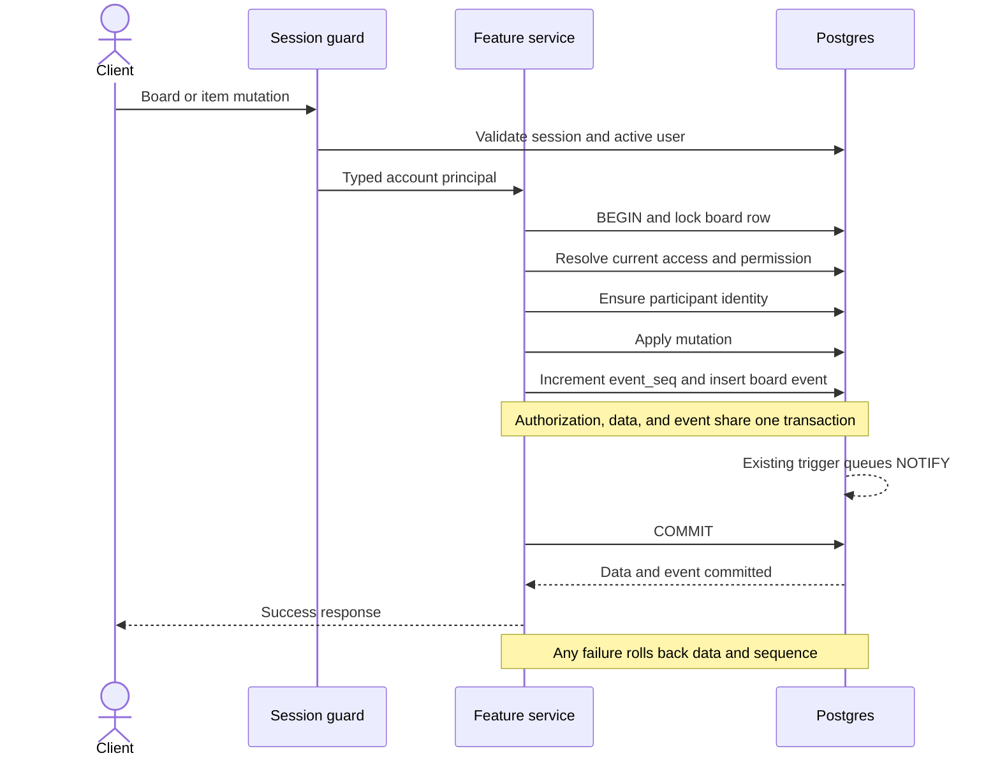

# Backend work unit 3: board core

Branch: `codex/backend-board-core`.

Signed-in users can create blank canvas boards in personal and business
workspaces, organize notes into sections, and edit, move, and soft-delete notes.
All changes and their board events commit together. This work unit uses the
existing schema and does not add or change a migration.

## Implemented HTTP surface

All routes require the existing opaque session cookie. Requests and responses
use camelCase fields, UUID identifiers, UTC ISO timestamps, and decimal strings
for bigint event sequences. Responses have `Cache-Control: no-store`.

| Method | Route | Permission | Result |
|--------|-------|------------|--------|
| POST | `/boards` | Workspace membership | 201 board metadata and `role` |
| GET | `/boards` | Signed in | Accessible boards with an existing caller participant row |
| GET | `/workspaces/:id/boards` | Workspace membership | Boards where the caller resolves a role |
| GET | `/boards/:id` | `board.view` | `{ board, sections, modules: [], role }` |
| PATCH | `/boards/:id` | `board.share` | 200 updated board metadata and `role` |
| POST | `/boards/:id/sections` | `item.edit` | 201 section |
| PATCH | `/boards/:id/sections/:sid` | `item.edit` | 200 section |
| DELETE | `/boards/:id/sections/:sid` | `item.edit` | 204; section items move to Unsorted |
| GET | `/boards/:id/items` | `board.view` | Live note array with price filtering |
| POST | `/boards/:id/items` | `item.create` | 201 note, or 200 existing same-board note |
| PATCH | `/items/:id` | `item.edit` | 200 note, or 409 with `currentItem` |
| PATCH | `/items/:id/position` | `item.move` | 200 note; content version unchanged |
| DELETE | `/items/:id` | `item.delete` | 204; repeated deletion writes no event |

The cross-workspace list is `GET /boards`, replacing the previously specified
`GET /me/boards`. It does not implicitly discover every business-owner board;
the workspace list does that. Opening a board creates a role-null identity if
one is needed, so that board then appears in the cross-workspace list while
access remains valid.

### Requests and defaults

- Board creation accepts `workspaceId`, `title`, optional `kitId: "blank"`, and
  optional nullable `currency`. Board updates accept `title` and `currency`.
  Titles are trimmed and contain 1–200 characters. Currency is null or three
  uppercase ASCII letters; this checks format rather than a currency catalogue.
- New boards are restricted blank canvases, have no modules or starter sections,
  and give their creator an explicit owner participant row. Currency defaults
  to null. Client associations, copies, and alternate kits are rejected.
- Section creation accepts `name` and `position`. Updates accept either field.
  Names are trimmed and contain 1–100 characters.
- Note creation requires client-generated `id`, `kind: "note"`, and `zOrder`.
  Optional fields are `title`, `note`, `priceCents`, `quantity`, `x`, `y`, and
  `sectionId`. Title, note, and price default to null. Quantity defaults to 1;
  coordinates default to `(0, 0)`; section defaults to null (Unsorted).
- Content patches require `version` and at least one of `title`, `note`,
  `priceCents`, or `quantity`. Position patches accept at least one of `x`, `y`,
  `zOrder`, or `sectionId`, and reject `version`.
- Note text preserves whitespace and has at most 20,000 characters. Nullable
  titles use the board title length rules. Prices are nonnegative integer cents;
  quantities are positive integers. Both fit Postgres signed integer columns.
  Coordinates must be finite and fit the existing Postgres `real` columns;
  nonzero values that round to zero at that precision are rejected.
- Ordering keys contain 1–128 ASCII alphanumeric characters. The API stores
  caller-provided keys and does not generate fractional indexes. Sections and
  items sort using `COLLATE "C"`, then id; board lists sort by creation time and id.
- Unknown fields, invalid identifiers, unsupported kinds/kits, and empty patches
  return 400. Section references outside the board return 404.

## Authorization and identity

The global session guard establishes account identity. The access feature then
resolves the account's role using the rules in [access control](05-access-control.md).
No session returns 401; no board access returns 404; insufficient permission on
an accessible board returns 403.

Explicit roles combine with workspace general access and business-owner recovery
by taking the highest role. A revoked or expired participant blocks all access
except business-owner recovery. Personal workspace owners do not automatically
open restricted boards. An account request gains no role from general link
access without a link session; link sessions are not implemented here.

Locked and archived boards cap all account roles at viewer. There are no routes
to change those lifecycle settings in this work unit. Editors and owners can
change notes and sections; only owners can change board metadata.

Opening a board or making a mutation creates a role-null participant row when
needed. This identity grants no access, changes no existing role or revocation,
and emits no event. Item `createdBy` and event attribution use participant ids,
not account ids or caller-supplied identities.

Every item response is filtered against `show_prices_to`. Readers below its role
threshold receive no `priceCents` property. The same serializer covers normal
reads, creation, retries, updates, movement, and stale-version responses.

CORS permits credentialed GET, POST, PATCH, DELETE, and OPTIONS from the existing
allowed origins. POST, PATCH, and PUT bodies must use JSON. Origin checks also
apply to DELETE without a body. Requests without Origin, such as curl, remain
supported.

## Transaction and concurrency boundaries

Feature controllers validate transport data, services coordinate transactions,
and repositories own parameterized SQL. All existing-board operations take the
board lock before child rows. Access is read after acquiring that lock, so a
request that waited does not reuse stale authorization. Read operations also
use the board lock to return a consistent detail or item list relative to writers.
Board creation protects the required workspace membership and atomically writes
the board, its owner participant, and `board.created`.

The event writer uses the supplied transaction manager, increments `event_seq`,
and inserts the corresponding event. It emits `board.created`, `board.updated`,
`section.created`, `section.updated`, `section.deleted`, `item.created`,
`item.updated`, `item.moved`, and `item.deleted`. Typed payloads contain identifiers,
content versions where relevant, and changed field names. They contain no note
text or monetary values.

Concurrent creates with one item id create one item and event. A same-board
retry ignores changed input and returns the existing item, including its tombstone
when deleted. It does not revalidate a formerly used section that has since been
removed. An id already used on another board returns 409. Retries still require
current authorization and a valid request body.

Content changes use an atomic version predicate and increment the version. A
stale request returns `{ statusCode: 409, message: "Item version conflict",
currentItem }`, without changing data or events. Position changes update only
position fields and leave the content version unchanged. Deleted items cannot
be edited or moved. Deletion is idempotent while the tombstone exists.

Deleting a section explicitly clears its items' `sectionId` and updates their
timestamps without changing content versions. One `section.deleted` event covers
that operation. A missing section returns 404.

The existing trigger still emits commit-time notifications. Events retain null
`fanned_out_at` and `dispatched_at` for the future dispatcher. There is no Redis
publishing, replay endpoint, worker, or realtime consumer here; Redis outages do
not interrupt board operations for existing Postgres sessions.

## Validation and deferred work

Contract and role unit tests cover validation, all four roles, revocation,
expiry, recovery, and read-only caps. Disposable Postgres integration tests cover
authorization, role-null identities, section scoping, rollback after event and
participant writes, duplicate and cross-board item ids, version conflicts,
independent movement, deletion, byte ordering, and access after lock acquisition.
HTTP tests exercise all routes, response contracts, onboarding in both workspace
types, isolation, price visibility, CORS, JSON/origin enforcement, and simulated
authentication Redis failure while board operations continue.

Run the normal `pnpm check` gate with disposable `TEST_DATABASE_URL` and
`TEST_REDIS_URL`; see the root README. No tests use the development stores.

Archive/unarchive routes, active-board limits, starter kits, clients, contact
links, invites, sharing controls, uploads, previews, copying, approvals, budget,
billing, exports, frontend, workers, and realtime remain later work units.
