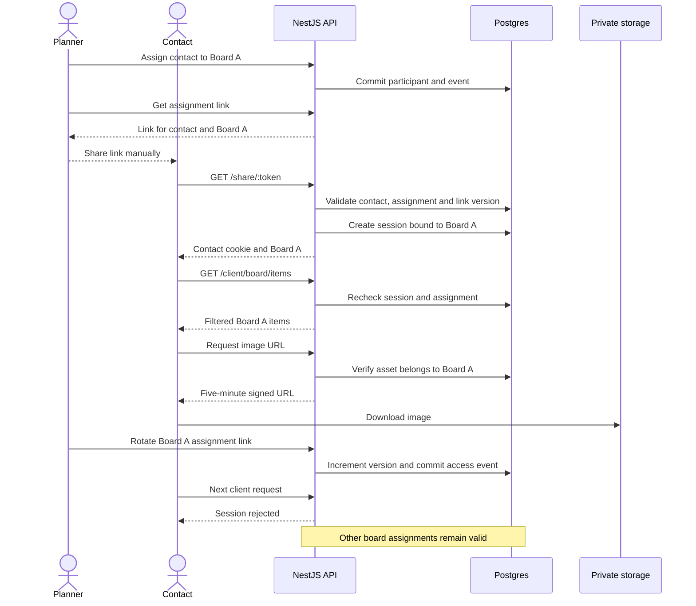

# Backend work unit 5: board-specific client access

Branch: `codex/backend-client-access`.

Business owners and staff manage clients and contacts. Board owners assign each
contact to selected boards as viewer or approver. Each assignment has a separate,
copyable link opening exactly one board without signup. A contact assigned to two
boards receives two links. Planners deliver links manually.

## Configuration and migration

Apply migrations before starting the updated API or worker:

```bash
pnpm install --frozen-lockfile
pnpm db:migrate
pnpm dev:api
```

Configure both fields in the ignored `.env` file to enable links:

```dotenv
LINK_SECRET=<random-secret-at-least-32-characters>
PUBLIC_API_URL=http://127.0.0.1:3001
```

Generate a secret locally with `openssl rand -base64 48`. Replace the old
`local-only-change-me` value if an existing `.env` contains it; that placeholder
is rejected. The public API URL is an origin without a path, query, credentials,
or trailing slash. Production requires HTTPS. All API instances must use the
same secret and URL. Changing the secret invalidates all assignment links and
contact sessions. Missing settings disable link issuance/exchange with 503.

The additive migration adds `board_participants.link_version` and
`contact_sessions`, preserving existing accounts, boards, participants, and media.
The reference schema matches cumulative migrations.

## Planner HTTP contracts

Management uses account cookies, strict camelCase JSON, UUID identifiers, UTC
timestamps, and `Cache-Control: no-store`.

| Method | Route | Permission / result |
|--------|-------|---------------------|
| GET | `/workspaces/:id/clients?includeArchived=true` | Business owner/staff; active clients by default |
| POST | `/workspaces/:id/clients` | Business owner/staff; `{ name }`, 201 client |
| DELETE | `/clients/:id` | Business owner/staff; idempotent archive, 204 |
| GET | `/clients/:id/contacts` | Business owner/staff; active contacts |
| POST | `/clients/:id/contacts` | Business owner/staff; `{ name, email? }`, 201 contact without a link |
| DELETE | `/contacts/:id` | Business owner/staff; anonymize and revoke all assignments, 204 |
| GET | `/boards/:id/participants` | `board.share`; contact participants, including revoked history |
| POST | `/boards/:id/participants` | `board.share`; `{ contactId, role, expiresAt? }`, 201 new / 200 existing |
| PATCH | `/boards/:id/participants/:pid` | `board.share`; `{ role?, expiresAt? }`, 200 participant |
| DELETE | `/boards/:id/participants/:pid` | `board.share`; idempotent revoke, 204 |
| GET | `/boards/:id/participants/:pid/link` | `board.share`; `{ url }` for a live assignment |
| POST | `/boards/:id/participants/:pid/new-link` | `board.share`; empty JSON `{}`, 200 `{ url }` |

Names are trimmed and contain 1–100 characters. Optional email uses the existing
normalization/validator and grants no account identity. Roles are viewer or
approver only. Expiry is null or a future UTC timestamp. Re-add an inactive
assignment to restore access; patches cannot restore it.

Board creation accepts optional `clientId`. Updates accept `clientId` to attach
an unassigned board. Association needs business owner/staff membership and an
active client in the board's workspace; updates also need `board.share`.
Responses include nullable `clientId`. The same association is a no-op;
reassignment/detachment returns 409. Contacts must belong to the board's client.

Archiving a client preserves existing associations and access. It rejects new
contacts, associations, and assignments. Existing links, rotation, participant
updates, and removal remain available under ordinary board permissions.
Assignment retries reuse participant identity. Identical active assignments emit
no event. Restoration rotates the link generation so old credentials never revive.

## Link exchange and client reads

Tokens are `<participantId>.<signature>`. HMAC-SHA256 signs
`contact-board:<participantId>:<linkVersion>` using base64url. The participant
identifies one contact and board. Links are rebuilt on demand; raw links and
session tokens are never stored. Comparison is constant-time and rejects
noncanonical signature encodings.

| Method | Route | Result |
|--------|-------|--------|
| GET | `/share/:token` | Public entry; `{ board, role }` and contact cookie |
| GET | `/client/board` | Session's board detail, sections, modules, and role |
| GET | `/client/board/items` | Session's live notes/images/links with filtered prices |
| GET | `/client/assets/:id/url?variant=original\|thumbnail` | Five-minute URL; asset must belong to the session's board |
| POST | `/client/logout` | Empty JSON `{}`; revoke session and clear cookie, 204 |

Exchange validates the contact, explicit assignment, board/client match, role,
revocation, expiry, and generation under locks. It creates only an authentication
session, never accounts, memberships, or participants.

The host-only `moodboard_contact` cookie lasts seven days, is HttpOnly and
SameSite=Lax, has path `/client`, and is Secure in production. Opening another
link replaces the browser's client context while preserving account login.
Client routes never use account permissions, even when both cookies are present.

Sessions store token hashes, participant/contact/board identity, issued link
version, signing-secret fingerprint, and expiry. Every read rechecks current
access. Contact roles are capped at approver; locked/archived boards cap them at
viewer. Prices use `showPricesTo`. Item lists expose no storage keys or signed
URLs. Signing rechecks authorization after awaited storage calls.



Editable diagram source: [client-access.mmd](diagrams/client-access.mmd).

## Revocation, transactions, and failures

Rotation affects only that assignment. Revocation rotates its generation and
deletes its sessions. Contact removal clears name/email, marks removal, revokes
every assignment, deletes all its sessions, and retains identity for history.
Issued storage URLs expire within five minutes. Contact-wide links are absent.

Parent client/contact locks precede boards; multi-board removal locks boards in
ID order. Authorization is checked after locking. Changes and events commit
together. Waiting reads cannot reuse stale principals. Events contain identifiers
and changed-field names without PII, prices, or credentials. New/restored grants
write `participant.joined`; permission changes, revocation, removal, and rotation
write `access.changed`. Realtime publishing remains deferred.

Invalid links return uniform 404; invalid sessions return 401; inaccessible
boards/assets return 404; insufficient account permissions return 403. Exchange
allows 30 attempts per minute per IP, then 429 with Retry-After. Redis failure
blocks new exchange with 503; existing reads/logout keep using Postgres. Storage
failure returns 503 while notes remain usable. Exchange uses no-store and
`Referrer-Policy: no-referrer`. Deployment proxies must not log share URLs,
cookies, or secrets. Daily maintenance prunes expired contact sessions.

## Validation and deferred work

Run `pnpm check` with disposable Postgres, Redis, and MinIO as described in the
root README. Tests cover two-board isolation, mixed cookies, media and redaction,
rotation/restoration, archive behavior, anonymization, secret/session expiry,
configuration, origins, and signing rechecks. Database tests cover rollback and
reads/exchanges/assignments waiting behind revocation/removal. Migration tests
verify upgrade, revert, and reference-schema parity.

Frontend, email, anonymous sharing, invites, account linking, realtime, approvals,
budget, kits, exports, and billing remain later work units.
