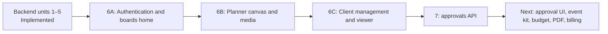
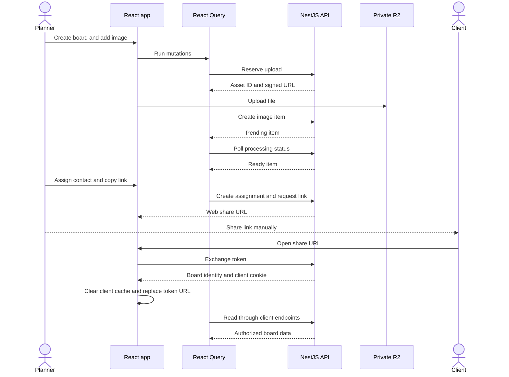

# Work unit 6: planner UI and client board viewer

The TanStack Start web app uses React Query for account and client API data and
Tailwind CSS for its responsive interface. It is available at
`http://127.0.0.1:3000` in local development. The NestJS API remains authoritative
for roles, board changes, and contact sessions.

## Build order

Editable source: [web-build-order.mmd](diagrams/web-build-order.mmd).

## Run locally

Apply migrations before starting the API. Set `LINK_SECRET` to a random string
of at least 32 characters, `PUBLIC_API_URL=http://127.0.0.1:3001`, and
`PUBLIC_WEB_URL=http://127.0.0.1:3000` in `.env`. Start Postgres and Redis, then
run `pnpm dev:api` and `pnpm dev:web` in separate terminals. The web app uses
`VITE_API_URL=http://127.0.0.1:3001` by default; override it when the API lives
elsewhere. Use the same hostname for the web app and API so their host-only,
SameSite cookies work together. Production origins must use HTTPS.

Image uploads require the four R2 settings, a private bucket, and the media
worker. Configure bucket CORS for the web origin, `PUT/GET/HEAD`, and
`Content-Type`. The browser sends the Blob and signed `Content-Type`; it lets
the browser supply the signed `Content-Length` automatically. The UI still
supports notes and links when storage is unavailable.

## Screens and data flow

`/` server-renders the complete public landing, with labeled generated example
imagery and an example board using the shared item-card presentation. Its Create
a board CTA opens `/login?mode=signup`; sign-in uses `/login?mode=login`. Signed-in
visitors navigate to `/boards` after the browser account query succeeds.
`/login` handles email/password account entry. `/boards` lists boards by
workspace and creates a blank board. `/boards/:boardId` edits sections, notes,
images, links, and item positions; its Share panel associates a business client,
assigns contacts, and manages board-specific links. `/clients` manages clients
and contacts. `/share/:token` exchanges a contact link and immediately replaces
the token URL with `/client/boards/:boardId`, where a contact can read only the
bound board. New assignments use viewer role; existing approver assignments
remain viewable until approvals UI arrives.

The root enables SSR for the public page. Authenticated, authentication, share,
and client routes retain `ssr: false`. Each root App instance creates its own
QueryClient so requests do not share a server-side account cache. Landing photos
offer 480/800/1440 responsive candidates, with later photographs lazy-loaded.

The board gallery reads actual items through account-prefixed queries. Preview
queries activate near the viewport, share item cache keys with the editor, and
use a 60-second stale time with no interval polling. Authorized thumbnail URL
queries have a four-minute stale time. Empty and failed previews show neutral
fallbacks, not generated demonstration boards. Global focus/reconnect refresh
and mutation invalidation still apply.

## Responsive visual behavior

The approved quiet canvas uses self-hosted Instrument Sans, semantic neutral
light/dark surfaces, and a restrained blue accent. The theme follows the system
unless the user chooses an override. See [DESIGN.md](../DESIGN.md) and
[design notes](08-design.md) for the actual tokens and component rules.

At 768px and above, the editor has a compact header, section rail, scrollable
freeform canvas with dots, floating image/link/note tools, zoom controls, and a
contextual item inspector. Below 768px, it uses horizontal section navigation,
inline add tools, and an item grid; the inspector becomes a native dialog bottom
sheet with protected focus and focus restoration. Create-item forms also use
the mobile sheet treatment. Header controls remain available when long board
titles truncate. Cards remain the same presentation on landing, editor, and
client viewer; prices and actions obey existing access rules.

Shared controls have at least 44px targets and visible keyboard focus. Controls,
cards, and dialogs use 8/12/16px radii. Canvas dots do not appear on landing,
gallery, or viewer. Hover/press feedback is restrained, and reduced-motion
preferences disable skeleton animation.

## API and cache flow

Editable source: [web-share-flow.mmd](diagrams/web-share-flow.mmd).

Account and client data use separate React Query key prefixes. Board data
refreshes while visible and after successful mutations; pending media refreshes
more frequently. A content conflict retains the local draft and offers a
conscious reapply against the current version. Item movement updates the canvas
immediately and rolls back on failure. Client reads recheck the board identity
in the URL, while another tab's client-context change hides stale content.

`PUBLIC_WEB_URL` is optional. If absent, new links continue to use the API URL.
When present, a browser opening an older API link is redirected to the web
entry; requests explicitly accepting JSON keep the existing exchange response.
Link exchange and client reads use `Cache-Control: no-store`. The web entry
requests `no-referrer` and removes the token from browser history after exchange.

## Verification

Run `pnpm check` against the disposable test services described in the root
README. Run `pnpm dev:web` with the API for browser verification. The expected
planner path is signup → business workspace → board → section → note/image/link
→ client/contact → assignment → copied link. On a phone, that link must open the
assigned board and show only authorized items and prices. Verify expired,
rotated, and revoked links, concurrent edit conflicts, image processing states,
keyboard movement, and desktop/mobile layouts. Media integration tests use
test-only MinIO; the running application uses Cloudflare R2.
