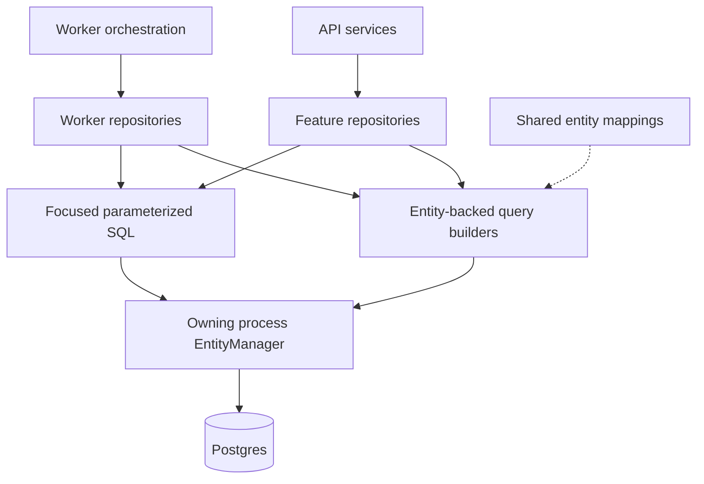
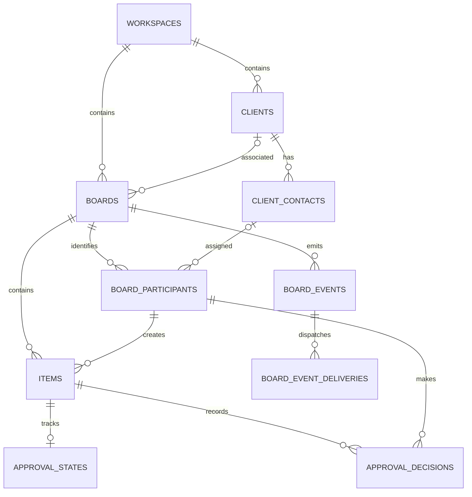

# Backend work unit 8: database mappings and query builders

This work unit cleans up persistence in both the API and worker using the pinned
TypeORM 0.3.31 installation. Public HTTP, event, and job contracts are unchanged.
Existing migrations remain the schema authority; there is no schema change or
data backfill in this work unit.

## Shared mappings

`packages/database/src/entities` uses one `*.entity.ts` file per entity, grouped into domain folders.
Each folder has an export index; the root index exports the public classes and
assembles the explicit registry. Shared enum values remain in `types.ts`.

| Folder | Mapped tables |
|--------|---------------|
| `accounts/` | `users`, `auth_sessions`, `google_auth_attempts` |
| `workspaces/` | `workspaces`, `workspace_members` |
| `clients/` | `clients`, `client_contacts` |
| `boards/` | `boards`, `board_participants`, `contact_sessions`, `sections`, `items` |
| `media/` | `assets`, `link_previews` |
| `outbox/` | `board_events`, `board_event_deliveries` |
| `approvals/` | `approval_states`, `approval_decisions` |

Every migrated column of these 18 tables is mapped, including columns that
current queries do not yet use. Unused billing, invitation, module, and legacy
Postgres rate-limit tables remain migration-owned and are not in the registry.
Add mappings when their runtime feature is introduced.

`databaseOptions` registers `databaseEntities` for API startup, the worker,
migration CLI, and test data sources. Shared code does not import NestJS or apps.
Each process still owns one pool, with its existing limits and lifecycle.

Properties are camelCase with explicit SQL column names. UUIDs are explicitly
supplied; only board event IDs use the existing `GENERATED ALWAYS AS IDENTITY`.
Bigint IDs and sequences stay strings, timestamps are `Date`, hashes are
`Buffer`, and enum names, arrays, JSON, nullability, and defaults match migrations.
Foreign-key IDs stay scalar; joins are explicit and the database enforces
constraints, including same-board composite foreign keys.

Version, timestamp, and deletion markers are ordinary columns. Content writes
use a version predicate and increment the content version; moves leave it alone.
Timestamps are explicitly updated where the existing use case requires it.
Tombstones remain readable for idempotent retries. Entity registration keeps
`synchronize` and `migrationsRun` disabled.

## Query ownership and transaction flow

[Editable flow source](diagrams/database-persistence.mmd) · [SVG export](diagrams/database-persistence.svg)

API feature repositories own reads and mutations. Assets and Google auth attempt
persistence now have repositories; client removal and approval services delegate
persistence to their existing repositories. Worker repositories own dispatch,
media, and maintenance queries; orchestration keeps resource/board locking,
transaction boundaries, queue/storage calls, retries, and event emission.

Ordinary operations use entity-backed query builders. Every transactional builder
is created from the supplied callback manager. No transaction query switches to a
global manager. Query-builder locks preserve client/contact-before-board ordering
and sorted multi-board locks. Delivery fanout uses `FOR UPDATE SKIP LOCKED`.

Focused SQL remains for advisory locks, atomic leased delivery claims, conditional
approval-state upserts, approval lateral queries/reconciliation, and bounded event
pruning. These operations remain parameterized and named. Runtime health probes,
migration inspection, maintenance session locks, and `LISTEN/NOTIFY` remain in
infrastructure adapters.

### Results, patches, and transport

Entity reads hydrate camelCase properties. Joined and aggregate raw projections
use named result types and explicit aliases. Mutation `RETURNING` records have
SQL column names and are converted with `entityFromRow`; affected-only operations
use the result's `affected` count. A raw projection is never implicitly treated
as a fully hydrated entity.

`definedPatch` replaces dynamic column-string assembly with a code-owned allowed
property list. Undefined leaves fields unchanged, null clears nullable fields,
and event changed-field arrays preserve request field ordering. Request values
remain bound parameters.

Owning features provide explicit response mappers. Mappers retain UTC timestamp
strings, price redaction by role, contact-specific approval output, and existing
HTTP shapes. Item media is loaded in batches; mapping does not introduce per-item
queries or expose credentials/storage keys. Table-shaped types derive from entity
classes; projections describe their additional joined or aggregate fields.

## Core relationships

This is the implemented core relationship view; columns and additional tables
are documented in [the data model](03-data-model.md).

[Editable relationship source](diagrams/database-core-relationships.mmd) · [SVG export](diagrams/database-core-relationships.svg)

The diagram describes database relationships, not an ORM cascade graph. Approval
states are optional: an item without one is pending. Completed sign-off is frozen
for the content version. Event deliveries use the composite `(event_id, target)`
key; contact and workspace identities keep their existing key constraints.

## Verification

- `entities.integration.spec.ts` compares every mapped column's name, SQL type,
  nullability, and primary-key membership against the migrated disposable
  database, checks mapped defaults and event identity, and prohibits automatic
  version/update-date/delete-date metadata. Round trips cover buffers, dates,
  arrays, JSON, nullable values, defaults, composite keys, and bigint values above
  JavaScript's safe integer range. Entity writes and outbox rollback share one
  transaction connection.
- `approvals.integration.spec.ts` covers concurrent approvals, identical decision
  retries, recorded result snapshots after edits, swap precedence, peer feedback
  isolation, viewer denial, roster revocation/expiry/removal, completed sign-off,
  moves versus content edits, old-version history, foreign/deleted items, locked
  boards, and rollback of decisions and resets when event writing fails.
- Existing account, board, item, client-access, media, dispatcher, and worker
  runtime suites verify behavior remains stable. Concurrency probes use actual
  Postgres blocking PIDs rather than matching query text.
- `pnpm check` gates formatting, lint, builds, type checking, unit tests,
  integration tests, and HTTP end-to-end tests using the disposable Postgres,
  Redis, and MinIO services documented in the root README.

Deploy the API and worker code normally. There is no new migration to apply,
no connection-setting change, no new runtime service, and no data conversion.
