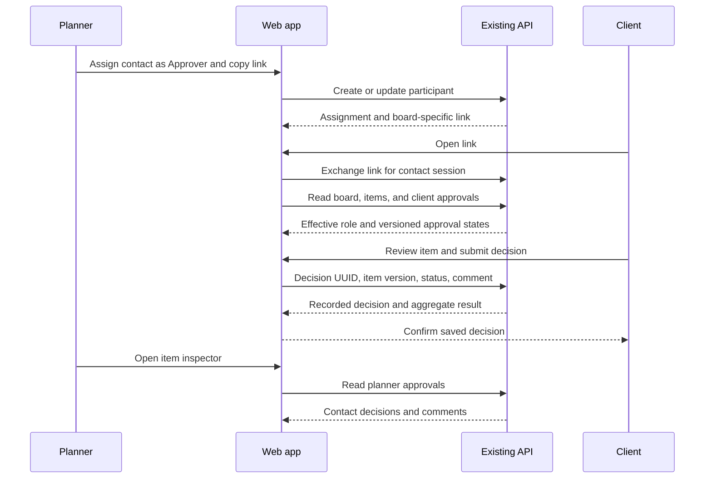
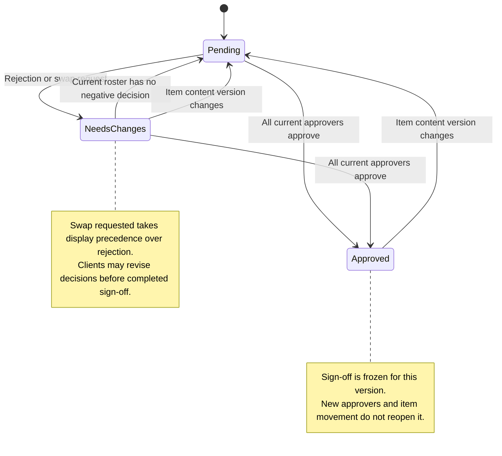

# Web work unit 9: client approvals

Client-associated business boards now support the complete web approval flow.
The backend remains authoritative: every current approver must approve the item
content version, completed sign-off is frozen, and content edits reset the round.
Moving an item does not reset it. Budgets, kits, exports, billing, realtime, generic
modules, historical feedback browsing, and bulk decisions remain later work.

## Planner workflow

The Share sheet assigns Viewer or Approver contacts; Viewer remains the default.
Existing assignments can change roles, and restoration names the restored role.
Owners manage sharing. Editors and owners see approval labels, counts and status
filters for the selected section (including Unsorted). Filtering leaves positions
unchanged. The item inspector shows each contact's latest decision, comment and
local timestamp for the current content version. Content edits start a new round.

## Client workflow

Each card shows the aggregate status and opens a Review sheet with the item,
board approval, and the contact's own decision. The client can Approve, Reject,
or Request swap. Comments are optional except for swaps; trimmed comments must
be at most 2,000 characters. Clients can revise decisions until completed
sign-off. Viewer contacts have read-only feedback, including their own previous
decision; account cookies never expand contact permissions. Completed sign-off
is read-only until the planner edits the item.

The interface uses existing Instrument Sans, semantic light/dark surfaces,
44px targets, visible focus and native dialog focus restoration. Feedback is
contextual, with no separate review dashboard.

## API and consistency

| Method | Existing endpoint | Web use |
|--------|-------------------|---------|
| GET | `/boards/:id/approvals` | Editor/owner feedback on a client-associated board |
| GET | `/client/board/approvals` | Aggregate statuses and own decisions |
| POST | `/client/board/approvals/decisions` | Immutable UUID/item-version decision request |

Shared Zod schemas validate responses and submissions. HTTP contracts and the
database schema are unchanged. Account and client query prefixes remain separate.
Client keys include the browser's contact-context generation. Reads poll every
15 seconds while visible and refresh on focus/reconnect. Planner item and sharing
mutations invalidate the board prefix, including approvals.

Approvals join to items by ID and content version. Mismatched reads trigger a
bounded refresh per distinct mismatch and offer Retry while inconsistent; stale
statuses never authorize decisions. Approval-read failures leave content usable
and show a retry message, with decisions disabled.

One UUID and immutable payload are captured per decision. Success appears only
after server confirmation. Network or server failures with an uncertain result
retain the original payload, including across sheet close/reopen, and offer
Retry same decision. A successful retry refreshes current reads, because the
recorded result may refer to an older item version. A 409 preserves the comment
and requires explicit review of refreshed content before a new submission.
A 403 refreshes permissions; 401/404 refresh board/items to distinguish lost
access from a removed item.

Link entry changes the contact-context generation and cancels/removes client
queries before exchanging cookies. Other tabs hide their old content and clear
review drafts. Client requests reject results from a changed generation, and
unmounted review sheets ignore late mutation callbacks.

## Flow diagrams

[Editable flow](diagrams/web-approvals-flow.mmd) · [SVG](diagrams/web-approvals-flow.svg)

[Editable state machine](diagrams/web-approvals-states.mmd) · [SVG](diagrams/web-approvals-states.svg)

## Verification

`tests/web-approvals.unit.spec.ts` covers exact identity/version joins, unknown
status handling, section/tombstone filtering, position preservation, comment
validation, and immutable UUID retry payloads. Existing backend approval suites
cover roster reconciliation, sign-off freezing, concurrency, privacy and rollback.

Run `pnpm check` against the disposable Postgres, Redis and MinIO services from
the root README. Browser verification uses a planner, two approvers, and a viewer:
partial approval, rejection, required swap comment, revised decision, frozen
sign-off, item edit/reset, movement, role changes, expiry/revocation and version
conflicts. Verify ambiguous retries and context changes during pending requests,
account/contact cookie isolation, peer feedback and hidden prices. Inspect
desktop/mobile light/dark layouts, keyboard navigation, restored focus, long
comments, loading and failed approval reads.

Deploy the web app against the current approvals API. No migration, service,
credential or configuration change is needed for this work unit.

### Browser verification results

Verified against a local API and disposable test data with a planner, two
approvers and a viewer. The browser flow covered partial approval, swap
validation, rejection/revision, final sign-off, movement preserving approval,
planner edits resetting the round, and approval of the new version. Planner
status filters matched the selected section and left positions intact.

A controlled gateway failure after committing a decision exercised Retry same
decision, including closing/reopening the sheet. A concurrent content edit
exercised 409 recovery and preserved the comment. Delaying a decision response
while opening another contact invitation hid the old context and discarded late
feedback. A failed approval read retained usable board content and disabled
decisions. Role downgrade exercised 403 refresh; expired contact access showed
the unavailable-board state. Revocation/restoration explicitly retained Viewer
role. Both account and contact cookies were present for privacy checks; client
views hid peer feedback and the planner-only price.

Visual checks covered 1280px desktop and 390px mobile in light/dark modes, long
comments without horizontal overflow, and Escape restoring focus to the original
Review button. The Impeccable detector reported no findings on the changed UI.
