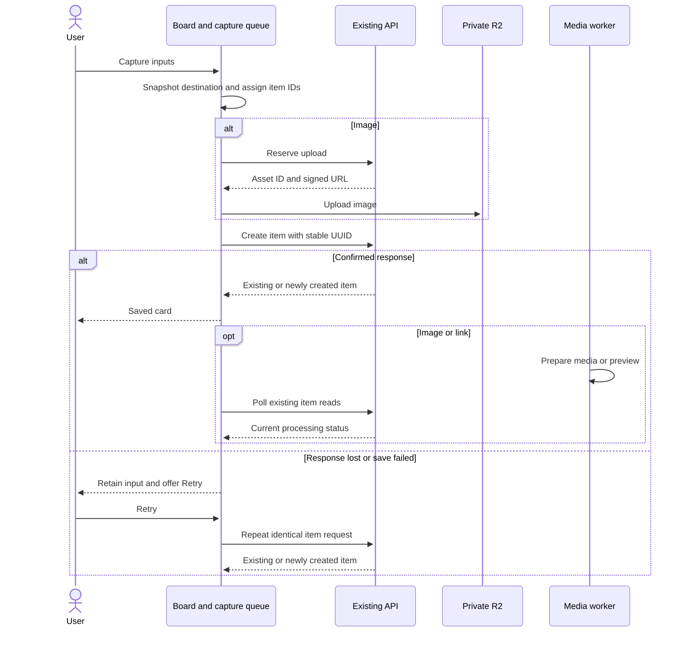

# Web work unit 10: quick capture

Moodboard starts with a blank board for ideas and plans. General board-making
comes first; client sharing and approvals remain an optional business path.
The gallery defaults to a personal workspace unless one is explicitly selected.
No kit picker, use-case questionnaire, API endpoint, or migration is added.

## Functional behavior

| Input | Result |
|-------|--------|
| One HTTP(S) URL | One link |
| Nonempty lines containing only valid URLs | One link per line, in order |
| Other plain text | One note preserving internal line breaks |
| Pasted image | One image |
| Dropped or selected image files | One image per valid file |

Paste on the board saves directly. Inputs, textareas, editable content, and
dialogs retain normal paste behavior. Clipboard/drop files take precedence over
their accompanying text or HTML. HTML-only content is ignored. A compact Note
or link composer accepts an optional title and explicit submission; Enter keeps
adding line breaks. Images opens the multiple-file picker directly.

Accept JPEG, PNG, and WebP up to 10 MiB each. Empty, oversized, and unsupported
files show individual reasons. Notes are capped at the existing 20,000-character
limit. Capture is available only to editors and owners.

## Destination, placement, and progress

Each input snapshots its board, selected section (or Unsorted), UUID, ordering
key, and position. A section switch never redirects an in-flight save. Desktop
drops account for scrolling, pan, and zoom; other inputs start near the visible
upper-left corner. Batches use 280px horizontal and 360px vertical spacing,
wrapping to the available width. Canvas bounds expand to contain their positions.
Existing items stay in place. Repeated non-drop captures skip occupied grid slots;
explicit drops keep their chosen anchor. Mobile uses the existing grid with stored positions.

Three pipelines save concurrently, with at most 20 unfinished entries. A gesture
that exceeds capacity is rejected entirely with a message; nothing is silently
truncated. Failed entries count toward capacity until saved or dismissed.

The progress tray shows Queued, Uploading, Saving, Saved, and Needs attention. Closing
the tray preserves entries. Failures offer Retry same save and Dismiss; successful
cards appear independently. Saved means server-confirmed, while image/preview
processing continues through the existing workers and polling. Saved input file
buffers are released, and displayed saved history is bounded.

## APIs and recovery

Reuse item creation, asset reservation, signed upload, item reads, and processing
polls. The API client accepts AbortSignals for capture creation and reservation.
No HTTP request or response shape changes.

Before image creation, retry a failed upload using its reservation or replace
an expired reservation. Once creation is attempted, freeze its payload and retain
its UUID and asset reference. An ambiguous retry never starts a replacement item.
Merge confirmed items by ID, preserve newer cached content, refresh authoritative
reads, and never reinsert a returned tombstone.

Permission/session failures pause remaining work and refresh access. Restored
permissions require explicit Resume saving or Retry same save. A removed section
produces an actionable failure without silently retargeting it: dismiss and
capture again in another section. Existing committed IDs are still reconciled by
the backend's idempotency path.

If access refresh fails, the unavailable-board view retains capture entries and
Dismiss controls. Queued entries can be dismissed while saving is paused;
uploads and saves already in progress remain protected until they finish.
Discarding every unfinished entry clears the pause so new captures can begin
when access is restored.
Retry and Resume stay disabled until successful reads establish
access; Check access again refreshes those reads without discarding the queue.

Queue state and files live only in memory while the board is open. Navigation and
reload warn about unfinished entries. Disposal aborts requests, stops queued work,
and ignores late UI callbacks. Already received requests can still commit;
reopening the board reads authoritative data. Browser unload warnings are subject
to the browser's usual interaction and mobile limitations.

## Diagrams

[Editable pipeline](diagrams/web-capture-flow.mmd)

[Editable sequence](diagrams/web-capture-save.mmd)

## Verification

`tests/web-capture.unit.spec.ts` exercises classification, file precedence and
limits, placement, bounded ordering, queue capacity, concurrency, destination
snapshots, partial failures, immutable retries, upload reservation reuse/expiry,
permission loss, deleted sections, disposal, and cache reconciliation.
Existing item and media integration suites verify one creation event per UUID,
retry reconciliation, and deleted tombstones against Postgres and test storage.

Run `pnpm check` with disposable Postgres, Redis, and MinIO as documented in the
root README. Browser verification covers desktop/mobile capture and progress,
normal field paste, image selection/paste, navigation warnings, light/dark themes,
keyboard focus, and partial failure/retry. Keep existing client approvals and
sharing regression checks in the full gate.

Reload recovery, offline saving, extensions, phone share integrations, general
sharing, duplication, multi-select, undo, specialist kits, and billing are deferred.
Select later work from real board-making friction.

### Verification results

The full repository gate passed: 174 unit tests, 120 integration tests, and 45
HTTP end-to-end tests (339 total), including existing approvals, client access,
and media regressions. The changed-UI detector reported no findings. Both Mermaid
sources validated and were exported to SVG.

Browser checks used a separate disposable Postgres schema, test-only MinIO, and
real API/media processors. Verified personal workspace default despite a business
workspace, board URL-list paste, mixed multiline composer text, normal field
paste, image paste, multiple-image selection, individual file failures, repeated
capture placement, tray close/reopen, safe retry after a simulated response loss
following commit, access-loss pause/recovery with retained inputs, and the in-app
navigation warning. The retried input produced
one item and one creation event. Enter preserved line breaks and Escape restored
focus to the composer trigger. Desktop and 390px mobile layouts were inspected
in light and dark modes.

Automation limitations: native drag gestures and interaction inside the responsive
frame were unavailable in this browser backend. Drop input interpretation and
pan/zoom/scroll placement are unit tested; mobile capture interactions and physical
drag gestures still need a manual device/browser pass. Pending inputs remain
in memory, as specified.
