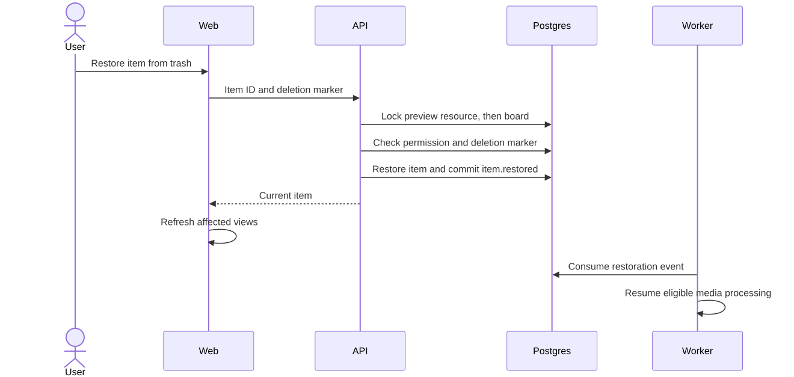

# Work unit 11: find and restore saved ideas

Signed-in account users can search their selected personal or business workspace
and recover deleted board items. Client contact sessions have no workspace search
or trash access. Editors and owners can use trash; viewers and approvers can
search only boards their account can currently view.

## Search

The boards gallery searches board titles, item titles/notes, and saved link URLs,
preview titles, descriptions, and site names. Matching is case-insensitive literal
substring matching: `%`, `_`, `!`, and backslashes do not act as query syntax.
Search starts after a 300 ms debounce. Board and item-type filters narrow results;
a type filter suppresses board results. Empty search returns to the gallery.

`GET /workspaces/:id/search` accepts `q` (trimmed, 1–200 characters), optional
`boardId`, `kind` (`note`, `image`, `link`), and opaque `cursor`. It returns
`{ results, nextCursor }` with at most 20 results. A board result contains
`{ type: 'board', board }`; an item result contains
`{ type: 'item', board, section, item }`. Board responses include the effective
account role; item responses use the existing price-redacting serializer.

Results order boards before items, then newest creation first, then UUID. Cursors
retain microsecond timestamp precision and are bound to the workspace, query, and
filters. Invalid cursors return 400. Authorization and matching share a repeatable
read snapshot. Every page resolves current board access before matching and
pagination; search does not create participants or reveal private boards merely
because the caller belongs to their workspace. An inaccessible selected board or
workspace returns 404. Search uses scoped Postgres queries and batch media loading,
without downloading every board's items to the browser.

Workspace, query, board, and kind live in gallery URL state. Account/workspace
query keys, AbortSignal cancellation, and hiding obsolete results prevent response
mix-ups when searches change. Browser Back restores the query and filters. An
item result opens `/boards/:boardId?item=:itemId`: the editor selects the item's
current section, clears approval filtering, selects the item, opens details, and
scrolls the desktop canvas or mobile grid. Missing/deleted items show an unavailable
notice. Existing board-access errors remain authoritative.

Editable source: [web-organization-search.mmd](diagrams/web-organization-search.mmd).

## Trash and restoration

`GET /boards/:id/items/trash` requires `item.delete` permission and accepts an
optional cursor. It returns `{ items, nextCursor }`, newest deletion first, with
at most 20 items and UUID tie-breaking. Existing tombstones appear without a
backfill. Deleted items do not expire; no permanent-delete action or automatic
purge is added. Referenced assets continue to survive storage maintenance.

`POST /items/:id/restore` requires the same permission, accepts
`{ deletedAt: '<timestamp shown in trash>' }`, and returns 200 with the existing
item response. It clears deletion and advances the modification timestamp while
preserving identity, content, position, media, creator, content version, and
approval history. Deleting a section already moves all its items to Unsorted,
including tombstones, so restoring does not resurrect a deleted section.

Restoration and `item.restored` commit in the same board-locked transaction.
Already-active items return current state without another restore event. A marker
from an earlier deletion returns 409 if the item has since been deleted again.
New deletion timestamps are millisecond-exact and strictly advance over the last
modification timestamp, so even rapid restore/delete cycles cannot reuse markers.
Old timestamps remain accepted as displayed by existing item serialization.
Edits, moves, and section removal also keep modification timestamps monotonic,
preventing a clock adjustment from reusing an earlier deletion marker.

Link restoration acquires the shared preview resource lock before the board lock,
matching creation and preview-completion lock order. The dispatcher handles
`item.restored` like `item.created`, processing pending images and pending/expired
previews with the existing generation and retry rules. Failed image status is
preserved. Current approval reconciliation still applies: signed-off versions
remain frozen; incomplete states reflect current active approvers. No content
version or approval reset occurs merely because an item was restored.

The editor's Trash action opens a desktop dialog or mobile sheet. It shows saved
content, deletion time, individual restore progress/errors, Load more, and a
View item action after restoration. Network failures retain retry controls;
changed permissions disable restoration. Item deletion is labeled Move to trash.
Mutations refresh board items, trash, approvals, gallery previews, and workspace
searches. The gallery's preview cache continues to share editor item query keys.

Editable source: [web-organization-restore.mmd](diagrams/web-organization-restore.mmd).

## Verification and boundaries

Run `pnpm check` against the disposable Postgres, Redis, and MinIO services.
Organization integration and HTTP tests cover search fields, literal characters,
filters, cursor boundaries, timestamp ties, role resolution, price redaction,
revocation/expiry, workspace isolation, trash pagination, duplicate restoration,
stale retries, removed sections, transaction rollback, approvals, and media dispatch.
Migration tests verify cumulative reference parity and reversible index creation.

The browser checklist covers desktop/mobile themes, keyboard focus, query/filter
navigation, item reveal, trash restoration, loading/error/empty states, and
existing capture and client-review paths. OCR, semantic/fuzzy search, board
archiving, bulk actions, general undo, permanent deletion, and persistent capture
drafts remain outside this work unit.
